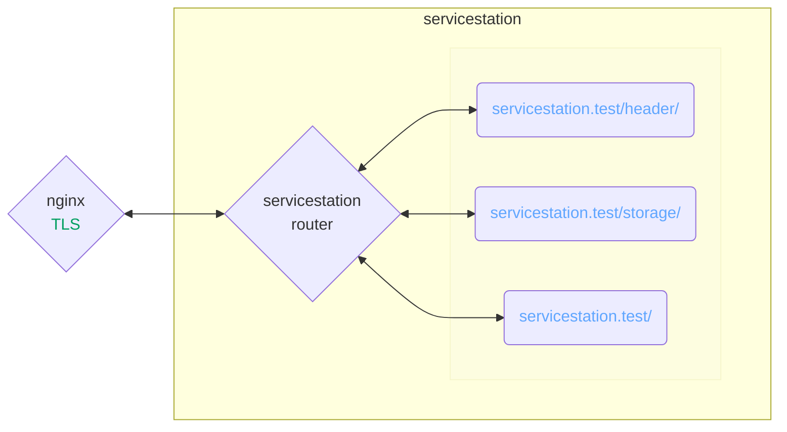

# ServiceStation/development

ServiceStation development environment.

## Architecture



## Installation

1. Install dependencies

* [Docker](https://docs.docker.com/desktop/)
* [mkcert](https://github.com/FiloSottile/mkcert)

2. Configure TLS

```sh
curl -fsSL https://raw.githubusercontent.com/joehehir/lend/master/lend.sh -o lend.sh \
    && /bin/bash lend.sh -v "servicestation-le" "servicestation.test www.servicestation.test"
```

## Running

```sh
docker compose up --build
```

## Development

```sh
# build local development image
docker compose -f ./docker-compose.yml -f ./docker-compose.local.yml up --build -V

# lint servicestation/dist
../src/node_modules/.bin/eslint -c ../src/.eslintrc.js ./servicestation/dist \
    && printf "\n  \033[0;32m%s\033[0m\n\n" "pass"

# test servicestation/dist
export NODE_TLS_REJECT_UNAUTHORIZED=0 \
    ; ../src/node_modules/.bin/_mocha ./servicestation/dist/index.test.js \
    ; export NODE_TLS_REJECT_UNAUTHORIZED=1
```
